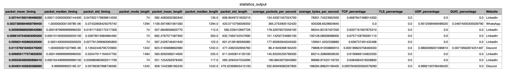
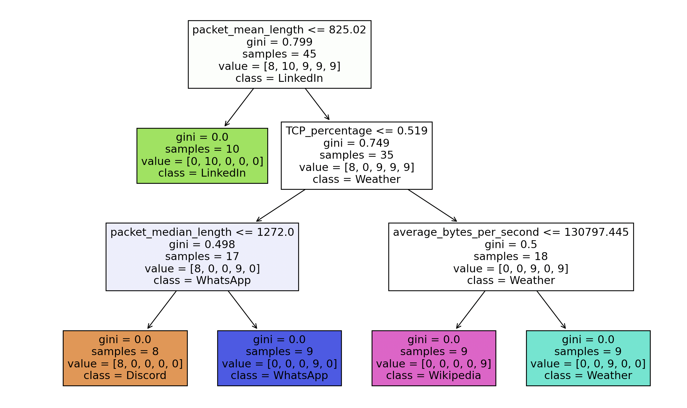
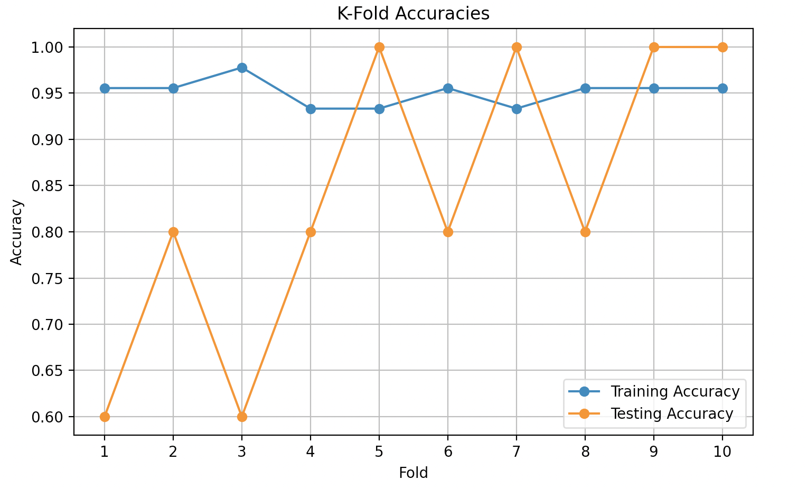
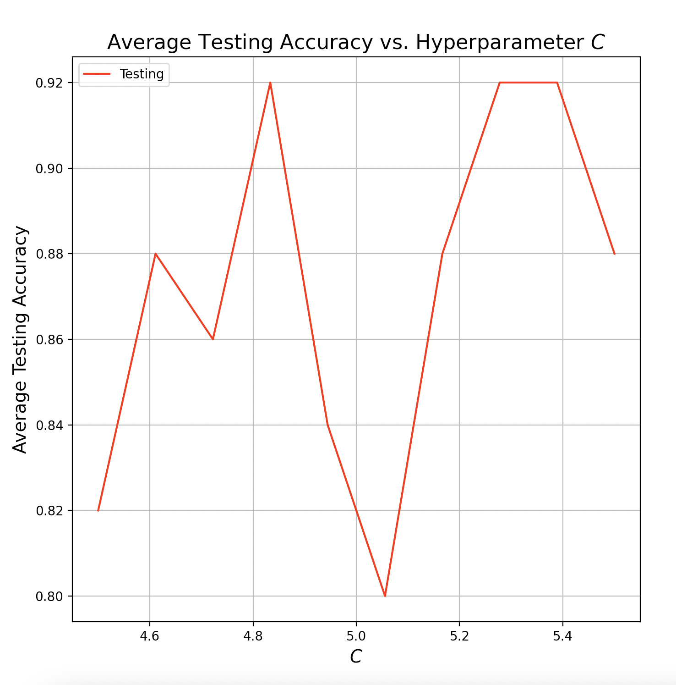
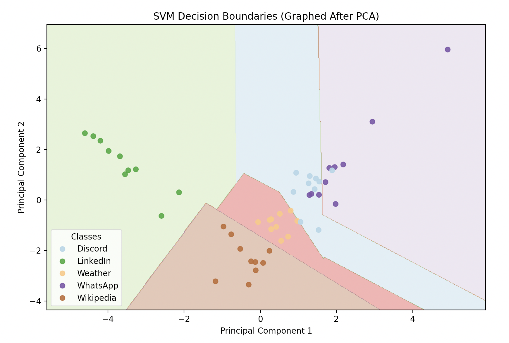

# Network Traffic Analyzer with Machine Learning

This project analyzes and predicts network traffic using various machine learning algorithms. It includes modules for data aggregation, preprocessing, and building predictive models.

## Features

- Assemble and preprocess network traffic data
- Build decision tree models
- Perform logistic regression analysis
- Create support vector machine (SVM) classifiers
- Visualize decision boundaries using PCA

## Example Results

### Preprocessed Data

An example of the features and preprocessed network traffic data.

### Decision Tree

A visualization of the decision tree model built from the network traffic data.

### Logistic Regression (K-Fold Cross-Validation)

Average training and testing accuracies from logistic regression with 10-Fold cross-validation.

### SVM C Optimization

Average testing accuracy across different C values for SVM optimization.

### SVM Decision Boundary

Decision boundaries plotted after applying PCA to the SVM model to reduce dimensionality to 2.

## Prerequisites

- Python 3
- Libraries: pandas, scikit-learn, matplotlib

## Installation

1. Clone this repository
2. Install the dependencies using pip

## Usage

1. Add your network traffic csv files from wireshark to a folder.
2. Run the `Controller.py` file using Python.
3. Follow the prompts to perform various tasks:

   - Type `1` to assemble and preprocess the dataset.
   - Type `2` to build a decision tree model.
   - Type `3` to perform logistic regression analysis.
   - Type `4` to create an SVM classifier.
   - Type `5` to generate strip plots on the features
   - Type any other key to exit the program.

## File Structure

- `Algorithms/`: Contains different machine learning algorithms
- `Data/`: Directory to store network traffic data files
- `Controller.py`: Main script to control the workflow

